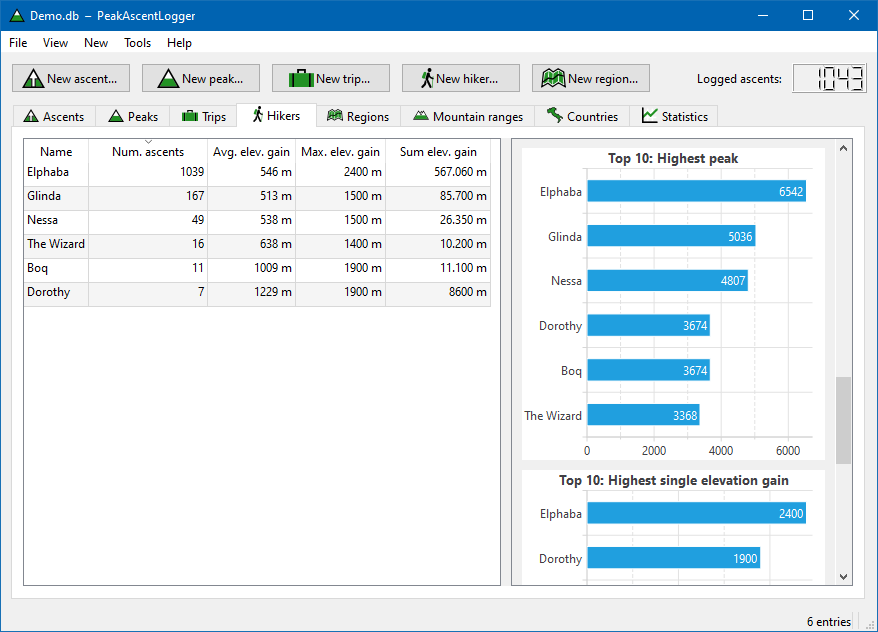
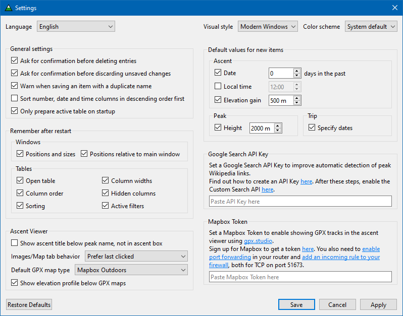

           

PeakAscentLogger (PAL)
======================

### A hiking database for logging and viewing scaled summits

PAL offers logging of peak ascents during hikes.
It is focused on individual peaks as opposed to whole hikes.

PAL consists of a main window, where stored information is shown in tables (for ascents, peaks and so on).
Additionally, there is an ascent viewing window to browse logged ascents one by one, showing details about each one as well as a description and photos.

A variety of interesting statistics is automatically generated from the user's data and displayed as extra columns or charts.

Screenshots
-----------

#### Main window with ascents table

#### Ascent viewer window

[More screenshots below](#more_screens)

Features
--------

For each peak ascent, the following data can be logged:

- Peak (see below)
- Date & time
- Elevation gain
- Kind of hike (normal, ski, snow, snowshoes)
- Traverse (y/n)
- Difficulty ([SAC hiking/SAC mountaineering/SAC ski/SAC snowshoe/UIAA](https://www.bergfreunde.eu/alpine-grades-calculator/))
- Trip the hike was part of
- Participants
- Description/notes (with support for Markdown and HTML)
- Photos with descriptions

Each peak itself has the following associated fields:

- Name
- Height
- Volcano (y/n)
- Region
	- Mountain range
	- Country
	- Continent
- Links to Wikipedia, Google Maps/Earth

Other features:

- Interactive statistics (selection-specific)
- Adding custom columns which can directly display or process data from the project database
- Filtering any table by any column, including custom ones, using customizable filters
- Editing items in bulk
- Autodetection of links for peaks, individually or in bulk
- Changing paths of referenced photos in bulk
- Data export in multiple modes and formats
- PAL supports dark mode with Qt's "Fusion" theme
	- To enable, choose style "Fusion" in the settings and set system theme to dark

The codebase is largely documented.

PAL employs an [SQLite](https://www.sqlite.org) database, so its project files can be opened, inspected and manipulated with any compatible software.

Building PAL
------------

PAL is currently built on [Qt 6.8.1](https://wiki.qt.io/Qt_6.8_Release).

If there is no [release](https://github.com/svetter/pal/releases) suitable for you or you want to make changes in the code, the easiest way to build PAL yourself is to install Qt6 along with Qt Creator, open the top-level project file [PAL.pro](PAL.pro), let Qt Creator configure the project and click build.

Contributions & translations
----------------------------

Besides the English base version, there is currently only a German translation.
New translations can be added with relative ease with no need to write code, using Qt Linguist.
If you want to contribute by creating a translation and don't know where to start, please reach out, ideally by creating an issue.

Stability
---------

At the moment, PAL is not tested comprehensively.
Changes to the database file are considered safe, so you don't need to worry a lot about data corruption.
Any problems with wrong or missing data due to bugs should be resolved after restarting the app.
Nevertheless, it is recommended to create frequent backups of the database file if it contains important data.

If you found a bug, please [create an issue](https://github.com/svetter/pal/issues/new) describing the problem and how to reproduce it.
You can attach your database file if it doesn't contain sensitive private data.

More screenshots <a name="more_screens">
----------------

#### Main window with hikers table shown

#### Dialog for creating or editing an ascent

#### Settings window

