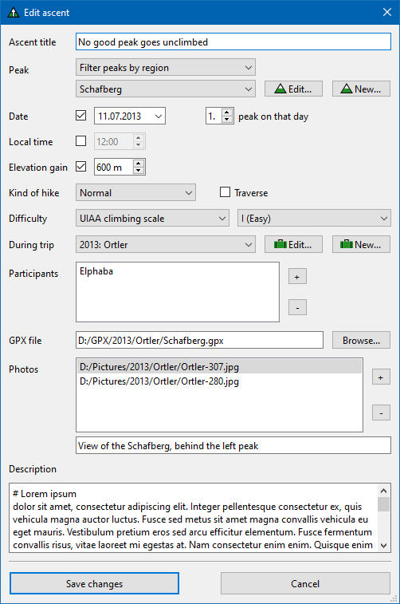

PeakAscentLogger (PAL)
======================

### A hiking database for logging and viewing scaled summits

PAL offers logging of each individual peak scaled during hikes.
It is focused on scaled peaks as opposed to whole hikes.

PAL consists of a main window, where stored information is shown in tables (for ascents, peaks and so on).
Additionally, there is an ascent viewing window to browse logged ascents one by one, showing details about each one as well as a description and photos.

Screenshots
----------

#### Main window with ascents table

#### Ascent viewer window

[More screenshots below](#more_screens)

Features
--------

For each peak ascent, the following data can be logged:

- Peak (see below)
- Date
- Time
- Elevation gain
- Kind of hike (normal, ski, snow, snowshoes)
- Traverse (y/n)
- Difficulty ([SAC hiking/SAC mountaineering/SAC ski/SAC snowshoe/UIAA](https://www.bergfreunde.eu/alpine-grades-calculator/))
- Trip the hike was part of
- Participants ("hikers")
- Description/notes
- Photos with descriptions

Each peak itself has the following associated fields:

- Name
- Height
- Volcano (y/n)
- Region
	- Mountain range
	- Country
	- Continent
- Links to Wikipedia, Google Earth/Maps

Other features:

- Filtering the ascents table by date, peak height, difficulty and more
- Automatically created statistics about peaks, hikers, trips, regions and countries
- Setting a default hiker which gets added to every new ascent automatically
- Changing paths of referenced photos in bulk
- PAL supports dark mode with Qt's "Fusion" theme
	- To enable, pass `fusion` as a program argument and set system theme to dark

Building PAL
------------

PAL is built on [Qt 6.5.0](https://wiki.qt.io/Qt_6.5_Release).

If there is no release suitable for you or you want to make changes in the code, the easiest way to build PAL yourself is to install Qt Creator, open the top-level project file [PAL.pro], let Qt Creator configure the project and click build.

Translations
------------

Besides the English base version, there is currently only a German translation.
New translations can be added with relative ease with no need to write code, using Qt Linguist.
If you want to contribute by creating a translation and don't know where to start, please reach out, ideally by creating an issue.

More screenshots <a name="more_screens">
----------------

#### Main window with hikers table shown

#### Dialog for creating or editing an ascent

#### Settings window

